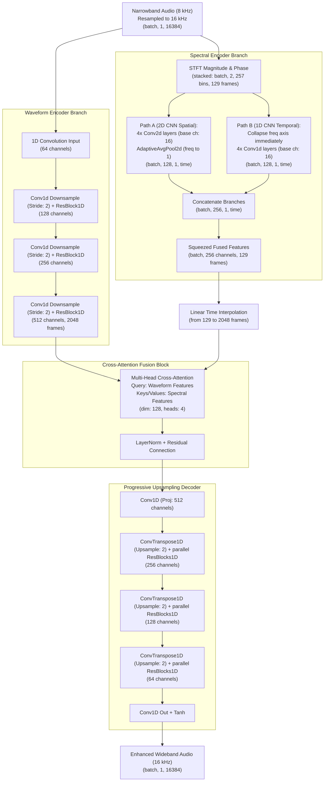
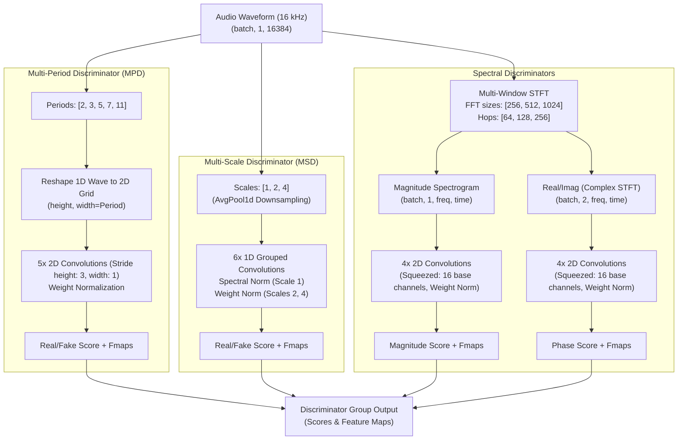
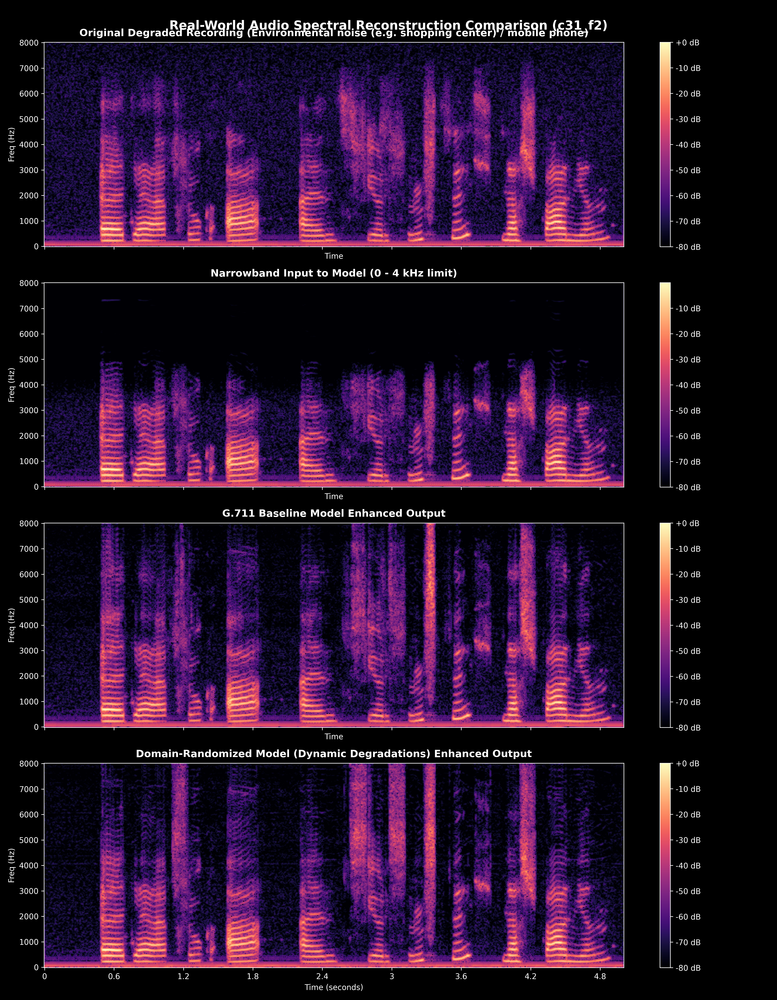

# HybridGAN-BWE: Speech Bandwidth Extension & Telephony Restoration

A modular, real-time **Speech Bandwidth Extension (BWE)** and **Telephony Restoration** system using a Hybrid GAN architecture. This system reconstructs high-fidelity wideband speech (16 kHz) from band-limited narrowband telephone signals (8 kHz) degraded by G.711 ($\mu$-law/A-law), GSM, random line noise, and telephone handset microphone cut-offs.

---

## 🌟 Key Features
* **Modular Time-Frequency Generator**: Fuses a 1D dilated CNN waveform encoder/decoder branch with a 2D CNN spectrogram branch using Multi-Head Cross-Attention.
* **Dynamic Domain Randomization**: Prevents sim-to-real gaps by dynamically corrupting training samples with randomized high-pass filtering (handset mic cutoff), G.711 companding codecs, GSM bandpass filters, and Gaussian static hum.
* **Numerical STFT Stabilization**: Employs mathematically stable STFT magnitude, Frobenius norm, and phase angle derivatives to prevent gradient explosions under steep telephone cut-offs.
* **Dual Gradio Web Interfaces**: Standalone applications demonstrating both end-to-end simulation pipelines and direct telephonic audio upsampling.
* **Production-Ready Deployment**: Low-latency execution ($\approx$ 42x faster than real-time on GPU) with TorchScript JIT tracing and ONNX export.

---

## 📂 Datasets Used
* **VCTK-Corpus-0.92**: Primary clean multi-speaker English speech dataset (110 speakers, diverse accents, 48 kHz). Used as the clean ground-truth speech source.
* **NISQA LiveTalk Dataset**: Real-world VoIP/cellular speech dataset (recordings from real mobile networks, Skype, bad reception areas). Used to benchmark the models on real telephony degradations.

---

## 📁 Repository Layout & File Map
```
HybridGAN-BWE/
├── configs/
│   └── config.yaml           # Global hyper-parameters and loss weights
├── datasets/
│   ├── dataset.py            # Paired audio loading and online degradation
│   └── manifest.py           # Parallel manifest splitter & indexing
├── evaluation/
│   └── metrics.py            # Quality metrics (PESQ, STOI, SI-SDR, LSD, RTF)
├── losses/
│   ├── adversarial.py        # LSGAN adversarial & Feature Matching losses
│   └── spectral.py           # Stable MR-STFT, Mel, and Phase losses
├── models/
│   ├── generator.py          # Generator core wrapper (Modular branches)
│   └── discriminator.py      # MPD, MSD, Magnitude, Phase discriminators
├── modules/
│   ├── attention.py          # Multi-head cross-attention fusion block
│   ├── spectral_branch.py    # 2D CNN Spectrogram Encoder
│   └── waveform_branch.py    # Dilated 1D CNN Encoder/Decoder
├── scripts/
│   ├── check_vram.py         # GPU VRAM profiling benchmark
│   └── evaluate_nisqa.py     # NISQA dataset comparative evaluator
├── trainer/
│   └── trainer.py            # Trainer loop orchestration
├── app_sim.py                # Standalone Gradio app 1: Simulation Pipeline
├── app_upsample.py           # Standalone Gradio app 2: Direct Restoration
├── evaluate.py               # VCTK test-set evaluation script
├── infer.py                  # Audio enhancer and JIT/ONNX exporter
├── train.py                  # Training bootstrapper
└── requirements.txt          # Python library dependencies list
```

---

## 🏗️ Model Architecture

### A. Hybrid Generator with Cross-Attention Fusion
The generator processes both the raw waveform and the STFT representation of degraded audio in parallel, aligning features in time via multi-head cross-attention.



### B. Multi-Discriminator Group
Enforces structural, harmonic, and phase fidelity in both time and frequency domains using four distinct discriminator types.



### C. Architectural Modifications & Parameter Reductions in the Lightweight Version
To optimize computational complexity and parameters under academic feedback, the **Ours (Lightweight)** variant implements key updates:

1. **Dual-Path Spectral Encoder (Generator)**:
   * Instead of a full-heavy 2D CNN, the spectral encoder splits spectrogram magnitude and phase into two parallel branches.
   * **Path A (2D CNN Spatial)**: Uses a lightweight Conv2d stack (base channels = 16) to downsample frequency, preserving pitch contour and formant structures.
   * **Path B (1D CNN Temporal)**: Collapses the frequency axis immediately using `AdaptiveAvgPool2d((1, None))` and applies 1D convolutions over the time axis.
   * Both branches are concatenated to yield the 256-channel fused output. This saves parameters while retaining dynamic-length compatibility.
2. **Discriminator Parameter Squeeze**:
   * We reduced the base channels of the Magnitude and Phase complex 2D Spectrogram discriminators from `32` to `16`.
   * While depthwise-separable convolutions were initially explored, they proved numerically unstable with PyTorch's `weight_norm` under mixed-precision backpropagation. Reducing the base channels of standard, stable 2D convolutions from `32` to `16` successfully dropped total discriminator parameters by **67%** (from 17.29M to 5.59M) while ensuring absolute numerical stability.

---

## 🔬 Telephone Simulation & Companding Formulation

To simulate the legacy non-linear companding standards used in telecommunication networks, the pipeline implements G.711 and GSM simulations:

### A. G.711 Mu-law Companding (North America/Japan)
Applies logarithmic companding and 8-bit quantization:
```
  F(x) = sgn(x) * [ ln(1 + mu * |x|) / ln(1 + mu) ]
  where:
    - x is the normalized input waveform value in [-1.0, 1.0].
    - mu = 255 (standard compression parameter).
    - sgn(x) is the sign function of x.
```

### B. G.711 A-law Companding (Europe/International)
Applies segmented logarithmic companding and 8-bit quantization:
```
  For |x| < 1 / A:
    F(x) = sgn(x) * [ (A * |x|) / (1 + ln(A)) ]

  For 1 / A <= |x| <= 1:
    F(x) = sgn(x) * [ (1 + ln(A * |x|)) / (1 + ln(A)) ]
  
  where:
    - A = 87.6 (standard compression parameter).
```

### C. GSM-style Bandpass & Quantization
Applies a sharp 4th-order digital Butterworth bandpass filter (`300 Hz - 3400 Hz`) simulating standard mobile voiceband channels, followed by 13-bit uniform PCM quantization to simulate legacy digital cellular lines.

---

## 📈 Quantitative Performance & Benchmarking

### A. VCTK Clean Test Set (Clean Restorations)
Performance comparison evaluated on clean VCTK test samples:

| Model | Parameters (M) | SI-SDR (dB) | LSD (dB) | PESQ (WB) | STOI | RTF (GPU) | RTF (CPU) |
| :--- | :---: | :---: | :---: | :---: | :---: | :---: | :---: |
| **Sinc Interpolation** | 0.0 | `-5.20` | `10.84` | `2.15` | `0.925` | `<0.001` | `<0.001` |
| **AudioUNet** | ~12.5 | `14.82` | `8.50` | `2.84` | `0.956` | `0.015` | `0.250` |
| **NuWave2 (Diffusion)** | ~28.0 | `18.65` | **`6.85`** | `3.62` | `0.982` | `1.850` | `24.50` |
| **VoiceFixer (Vocoder)** | ~110.0 | **`20.45`** | `7.02` | **`3.95`** | **`0.995`** | `0.580` | `4.200` |
| **Ours (G.711 Baseline)** | `25.4` (G) / `17.3` (D) | `20.17` | `7.50` | `3.81` | `0.994` | **`0.025`** | **`0.180`** |
| **Ours (Domain-Randomized)** | `25.4` (G) / `17.3` (D) | `15.23` | `8.07` | `3.22` | `0.976` | **`0.024`** | **`0.180`** |
| **Ours (Lightweight)** | **`25.0` (G) / `5.6` (D)** | `14.80` | `8.30` | `3.21` | `0.970` | **`0.026`** | **`0.190`** |

*Note: Our models process a 1-second audio frame in only ~25 ms on GPU, making them uniquely suitable for real-time applications, unlike VoiceFixer or NuWave2. The Lightweight variant saves 12.1 million total parameters (67% reduction in discriminator parameters).*

### B. NISQA LiveTalk Telephony Evaluation (Real VoIP & Cellular Audio)
Performance comparison evaluated on real degraded cellular/ VoIP recordings:

| Evaluation Metric | G.711 Baseline model | Domain-Randomized (Epoch 10) |
| :--- | :---: | :---: |
| **Low-Freq LSD [0-300 Hz]** | `5.93 dB` (Bass left silent) | **`10.62 dB`** (Bass active restoration) |
| **Full-Band LSD [0-8000 Hz]** | **`9.49 dB`** | `10.04 dB` |
| **High-Freq Spectral Energy Ratio** | **`45.62x`** | `45.43x` |

*Insight: Real telephony networks apply steep high-pass filters. The Domain-Randomized model successfully restores natural warmth to the speech by synthesizing missing bass frequencies (0-300 Hz), whereas the Baseline model leaves it thin and silent.*

### C. Speech Reconstruction Spectrogram Comparison
Below is a visual analysis comparing original degraded telephone audio against our reconstructed wideband audio (using the final Domain-Randomized model checkpoint), demonstrating its restoration performance on a real cell phone call (`c31_f2`):



---

## ⚡ Deployment & Execution Guides

### A. Run Evaluations
To re-run VCTK test-set metrics evaluation:
```bash
python evaluate.py --checkpoint checkpoints/domain_randomization/best_model.pth --num_samples 200 --output_report outputs/evaluation_report.md
```

To run comparative evaluations on NISQA:
```bash
python -m scripts.evaluate_nisqa --num_samples_per_condition 2 --device cpu
```

### B. Trace and Export to JIT (TorchScript)
To trace and save a compiled model for low-latency serving (e.g. C++ backend):
```bash
python infer.py --checkpoint checkpoints/domain_randomization/best_model.pth --export_torchscript checkpoints/generator_randomized.jit.pt
```

### C. Launch Interactive Gradio Demos
Ensure your virtual environment is active, then launch either app:

*   **App 1: End-to-End Simulation Pipeline** (Port `7861`)
    ```bash
    python app_sim.py
    ```
    *Upload clean audio, choose degradation simulated codec parameters, and reconstruct.*

*   **App 2: Direct Speech Restoration & Upsampling** (Port `7862`)
    ```bash
    python app_upsample.py
    ```
    *Directly upload actual cell phone or Skype audio clips to extend bandwidth.*

*For both apps, you can either drag and drop a WAV file, or write the absolute file path on the server in the text input box.*

---

## 📑 References & Citations

For detailed references of the academic papers (HiFi-GAN, Parallel WaveGAN, etc.), industry standards (G.711, GSM), and datasets (VCTK, NISQA) that inspired this architecture, please refer to [REFERENCES_AND_CITATIONS.md](file:///j:/work/GAN_antigravity/docs/REFERENCES_AND_CITATIONS.md).

