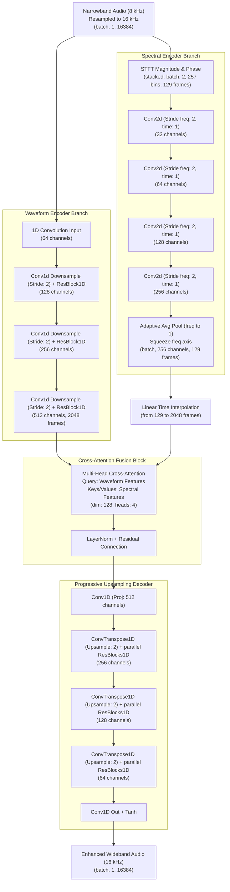
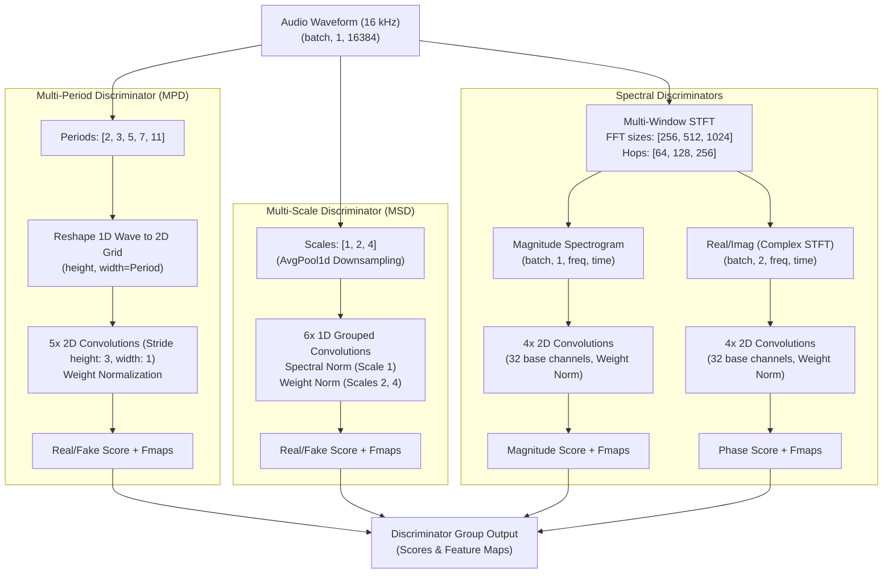

# HybridGAN-BWE: Architecture & Training Reference Guide

This document provides a comprehensive technical overview of the Speech Bandwidth Extension (BWE) system, detailing the repository file functions, datasets, the mathematical formulation of loss components, the training parameters, and visual diagrams of the network architectures.

---

## 1. Directory Structure & File Map

Below is the directory layout of the project, including a description of what each file does.

```
HybridGAN-BWE/
├── configs/
│   └── config.yaml           # Global configurations and parameters
├── datasets/
│   ├── dataset.py            # Paired audio dataset and dataloader
│   └── manifest.py           # Parallel indexing & manifest splitter
├── evaluation/
│   └── metrics.py            # Quality metrics (PESQ, STOI, SI-SDR, LSD, RTF)
├── losses/
│   ├── adversarial.py        # LSGAN adversarial & Feature Matching losses
│   └── spectral.py           # MR-STFT, Mel, and Phase Consistency losses
├── models/
│   ├── generator.py          # Generator core wrapper (Modular branches)
│   └── discriminator.py      # MPD, MSD, Magnitude, Phase discriminators
├── modules/
│   ├── attention.py          # Multi-head cross-attention fusion block
│   ├── spectral_branch.py    # 2D CNN Spectrogram (Mag + Phase) Encoder
│   └── waveform_branch.py    # Dilated 1D CNN Waveform Encoder/Decoder
├── scripts/
│   ├── check_vram.py         # GPU VRAM profiling benchmark
│   ├── download_ljspeech.py  # LJSpeech dataset downloader & extractor
│   ├── download_vctk.py      # VCTK dataset downloader & extractor
│   └── train_vctk.py         # In-parallel indexer and VCTK train launcher
├── trainer/
│   └── trainer.py            # Training pipeline orchestration
├── evaluate.py               # Test-set evaluation report generator
├── infer.py                  # Audio enhancer and JIT/ONNX exporter
├── train.py                  # LJSpeech manifests & training bootstrapper
└── requirements.txt          # Third-party library dependencies list
```

---

## 2. Dataset Specifications

The model has been configured and trained on two main datasets:

### A. LJSpeech-1.1 (Secondary/Validation Baseline)
*   **Audio Properties:** Single-speaker (female), 22,050 Hz wideband.
*   **Total Files:** 13,100 audio recordings.
*   **Training Configuration:** Split into 10,480 train, 1,310 validation, 1,310 test files. 
*   **Status:** **10 epochs training completed successfully** (final Val Loss: `2.0844`).

### B. VCTK-Corpus-0.92 (Primary/Robust Multi-Speaker Baseline)
*   **Audio Properties:** Multi-speaker (110 speakers, diverse accents), 48,000 Hz wideband.
*   **Total Files:** 88,328 audio files (due to dual microphone channels `mic1` and `mic2`).
*   **Training Configuration:** Split into 70,662 train, 8,833 validation, 8,833 test files.
*   **Status:** **Currently active** (scheduled for 10 epochs on GPU).

---

## 3. Telephone Simulation & Filter Details

To evaluate BWE robustness, the system implements a configurable voiceband telephone channel degradation pipeline ([degradation.py](file:///j:/work/GAN_antigravity/utils/degradation.py)). The pipeline degrades wideband input signals to simulate low-bandwidth channels using three primary techniques:

### A. Kaiser-Windowed Sinc Resampling (Anti-Aliasing & Reconstruction)
When converting audio between different sampling rates (e.g., from 16 kHz wideband down to 8 kHz narrowband, and back to 16 kHz for generator input):
*   **Downsampling (16 kHz &rarr; 8 kHz):** A Kaiser-windowed sinc filter acts as a brickwall anti-aliasing low-pass filter with a cutoff frequency ($f_c$) of 4 kHz. This removes all frequencies above the Nyquist rate of the downsampled signal to prevent aliasing.
*   **Upsampling (8 kHz &rarr; 16 kHz):** A similar Kaiser-windowed sinc filter is applied as an interpolation/reconstruction filter to upscale the low-resolution waveform back to 16 kHz before passing it to the generator.

### B. Butterworth Bandpass Filter (GSM Simulation)
When the degradation type is set to `gsm_sim`:
*   **Passband:** 300 Hz to 3400 Hz (standard telecommunication voiceband).
*   **Filter Type:** A 4th-order digital Butterworth bandpass filter is designed and applied via zero-phase filtering (`scipy.signal.filtfilt`).
*   **Roll-off:** The 4th-order design provides a sharp attenuation of frequencies outside the passband, simulating a realistic legacy analog telephone line response.
*   **Quantization:** Following the bandpass filter, the signal is quantized using 13-bit uniform PCM quantization, introducing standard digital quantization noise.

### C. G.711 Companding & Codecs
For non-linear quantization and companding, two standards are simulated at 8 kHz:
*   **G.711 $\mu$-law:** 
    *   Typically used in North American and Japanese landline networks.
    *   Applies logarithmic compression followed by 8-bit uniform quantization:
        $$F(x) = \operatorname{sgn}(x) \frac{\ln(1 + \mu |x|)}{\ln(1 + \mu)} \quad \text{for } \mu = 255$$
*   **G.711 A-law:** 
    *   Used in Europe and international telephone systems.
    *   Applies logarithmic compression followed by 8-bit uniform quantization:
        $$F(x) = \begin{cases} \operatorname{sgn}(x) \frac{A |x|}{1 + \ln(A)} & \text{for } |x| < \frac{1}{A} \\ \operatorname{sgn}(x) \frac{1 + \ln(A |x|)}{1 + \ln(A)} & \text{for } \frac{1}{A} \le |x| \le 1 \end{cases} \quad \text{for } A = 87.6$$

### D. Dynamic Domain Randomization (VoIP & Cellular Simulation)
To bridge the **sim-to-real gap** and make the network robust to real cellular/VoIP telephone calls, a `"dynamic"` degradation mode is implemented:
*   **Randomized High-Pass Filtering**: Simulates low-frequency telephone handset microphone cut-offs by dynamically applying a 4th-order digital Butterworth high-pass filter with a randomized cutoff frequency between $50\text{ Hz}$ and $300\text{ Hz}$ (applied with 80% probability).
*   **Dynamic Codec Mixing**: For each audio segment, the pipeline randomly selects and processes the sample through G.711 $\mu$-law (30% probability), G.711 A-law (30% probability), GSM Simulation (30% probability), or pure downsampling (10% probability).
*   **Analog Static Noise Injection**: Injects Gaussian white noise with a randomized Signal-to-Noise Ratio (SNR) between $25\text{ dB}$ and $50\text{ dB}$ to simulate line static/hum (applied with 70% probability).

> [!NOTE]
> The primary role of the HybridGAN-BWE generator is to reconstruct the cut-off frequency ranges (e.g., recovering low-end bass below 300 Hz and high-end treble above 3.4/4 kHz) and suppress the quantization noise and static hiss introduced by these telephone degradations.

---

## 4. Generator Architecture

The generator is designed as a modular **Hybrid Time-Frequency Network** that processes both the raw waveform and the STFT representation of degraded audio, aligning them in time via Multi-Head Cross-Attention.

### Visual Architecture Flowchart (Generator)



### Component Details & Parameters
1.  **Waveform Encoder**: Downsamples the 1D waveform by a factor of 8 (strides: `[2, 2, 2]`) using Conv1D kernels (`15`), with parallel `ResBlock1D` units applying dilated convolutions (dilations: `[1, 2, 4, 8]`).
2.  **Spectral Encoder**: Stack of four 2D Convolutions with kernel size `(5, 3)` and stride `(2, 1)`. The frequency dimension is downsampled from `257` to `17` bins and pooled to `1` by `AdaptiveAvgPool2d`, keeping the temporal frame sequence intact.
3.  **Cross-Attention**: Projects waveform (512 ch) and spectral (256 ch) maps to `dim=128`. Transposes shapes to sequence-first format and computes multihead cross-attention (4 heads) query-directed by the waveform context.
4.  **Progressive Decoder**: Reconstructs the 1D signal by upsampling 8x (rates: `[2, 2, 2]`) using transposed 1D convolutions with kernel size `16`, followed by parallel ResBlocks (kernel sizes: `[3, 7, 11]`, dilations: `[[1, 3, 5], [1, 3, 5], [1, 3, 5]]`).

---

## 5. Multi-Discriminator Group Architecture

To enforce high fidelity in both the time and frequency domains, the system employs **four independent classes** of discriminators grouped together.



### Component Details
*   **Multi-Period Discriminator (MPD)**: Group of 5 sub-discriminators. Reshapes the 1D audio sequence into 2D matrices of width $p \in [2, 3, 5, 7, 11]$. Captures periodic features and harmonic intervals.
*   **Multi-Scale Discriminator (MSD)**: Group of 3 sub-discriminators. Processes the waveform at full, $2\times$ average-pooled, and $4\times$ average-pooled resolutions. Captures local and global time-domain characteristics.
*   **Magnitude Spectrogram Discriminator**: Evaluates the 2D magnitude structures across 3 STFT window scales (256, 512, 1024), detecting high-frequency spectral patterns and energy consistency.
*   **Phase Spectrogram Discriminator**: Operates on stacked Real & Imaginary parts (2 channels) of the complex STFT output. Backpropagates phase-aware alignment gradients.

---

## 6. Loss Formulation & Weights

The models are optimized using a hybrid loss function consisting of adversarial, structural, and perceptual components.

| Loss Component | Objective / Function | Config Weight |
| :--- | :--- | :---: |
| **Generator Adversarial** | Least-Squares (LSGAN) loss: $\mathcal{L}_{adv}(G) = \frac{1}{2} \sum (D_i(y_{fake}) - 1)^2$ | `1.0` |
| **Discriminator Adversarial** | LSGAN loss: $\mathcal{L}_{adv}(D) = \frac{1}{2} \sum [ (D_i(y) - 1)^2 + D_i(y_{fake})^2 ]$ | `1.0` |
| **Feature Matching** | L1 distance between intermediate discriminator feature maps of real and fake audio | `2.0` |
| **Waveform L1** | Time-domain absolute reconstruction error: $\| y - y_{fake} \|_1$ | `100.0` |
| **Multi-Resolution STFT** | Sum of Spectral Convergence & Log-Magnitude losses across three STFT resolutions | `15.0` |
| **Phase Consistency** | Continuous Cosine & Sine distance on STFT phase angles to prevent phase-wrapping errors | `45.0` |
| **Mel Spectrogram L1** | Perceptual match using log-scale Mel spectrograms (80 Mel bands) | `45.0` |

---

## 7. Training Hyper-Parameters

The following settings from `config.yaml` govern the optimizer and execution pipeline:

| Parameter | Configuration Value | Purpose |
| :--- | :--- | :--- |
| **Batch Size** | `9` | Number of segments loaded per GPU step (optimized for 7.2 GB VRAM) |
| **Segment Length** | `16384` samples | Length of processed audio chunk (~1.024s at 16kHz) |
| **Learning Rate** | `0.0002` | Starting learning rate for G and D optimizers |
| **LR Decay Rate** | `0.999` | Exponential decay factor applied per epoch |
| **Adam Betas** | `(0.8, 0.99)` | Optimization momentum settings for AdamW |
| **Gradient Accumulation** | `1 step` | Effective batch size is 9 (updates gradients at every step for faster convergence) |
| **Mixed Precision** | `True` | FP16/AMP enabled dynamically on CUDA |
| **Grad Clip Threshold** | `10.0` | Standard norm ceiling to clip exploding gradients |
| **Early Stopping** | `15 epochs` | Halts training early if validation loss fails to decrease |
